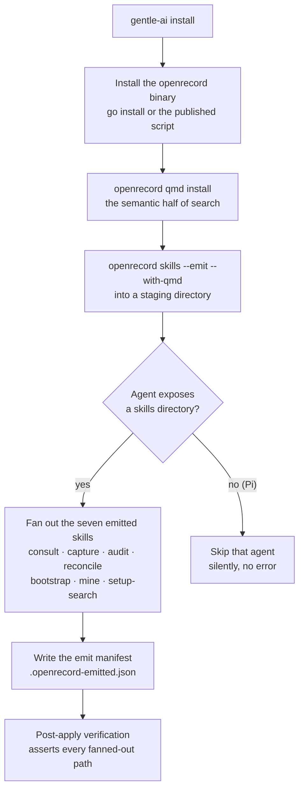
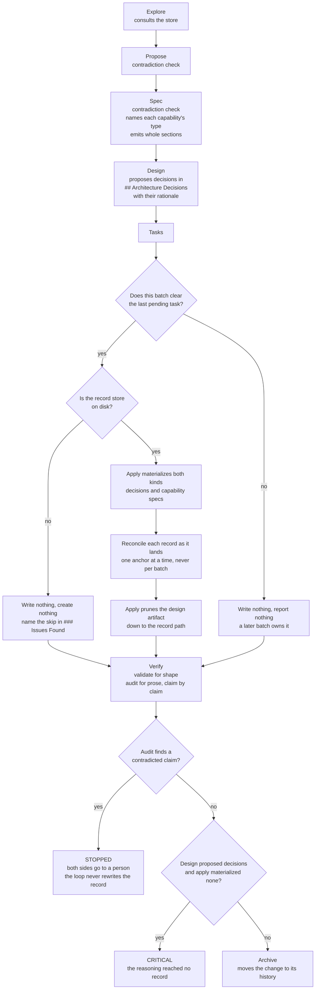
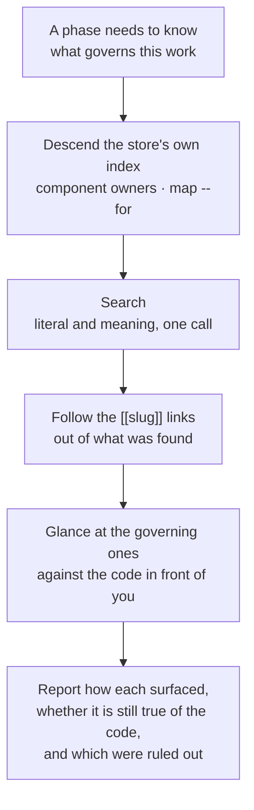

# openrecord inside Gentle AI

<- [Back to README](../README.md)

---

Gentle AI runs two stores, and the line between them is one question: **can this stop a future change?**

Yes, it governs — it is a **record**, and openrecord holds it. No, it only helps someone resume — it is **memory**, and Engram holds it. Engram is also the bus: every SDD phase runs headless with no memory, so writing to a topic key is the only way one phase reaches the next.

openrecord is a first-class component. It ships in every non-custom preset, the doctor fails without its binary, and nothing asks whether it is enabled — there is no config key, no status field and no injected value for a phase to consult before acting.

---

## What install puts in place

The skills ship with the binary and are re-emitted on upgrade. Gentle AI never writes its own copy of them: a private copy drifts from the tool silently, and the first symptom is a store that fails `validate` for reasons nobody can trace.

**That rule is also what makes upgrades free.** The shared convention every SDD phase reads points at each skill rather than restating it, so a release that deepens a skill reaches the phases without Gentle AI changing a line — `sdd-explore` inherited consult's code check exactly that way.

`--with-qmd` is not decoration. Without it no emitted skill mentions semantic search at all, so install provisions qmd first and the flag always matches reality.

---

## How a change moves through the two stores

**Apply is the sole writer.** No other phase touches the store — not design, which proposes without writing, and not archive, which never touches it at all.

**The prune is what makes the write a move rather than a copy.** Design writes each decision's rationale in full, because that artifact is the only channel apply has to read it. Once the record holds it, a second durable copy is exactly the duplication this boundary exists to remove, so apply rewrites the artifact down to the record's path and nothing else — no status word, since the record carries the status.

**No write, no prune.** When the store is absent apply materializes nothing, and pruning then would destroy the only copy of the reasoning that exists.

**Reconcile runs per record, never per batch.** Its anchor mechanism is single-record by design, so a batch materializing four records runs it four times. A merged pass over the batch would average away the one pair that actually conflicts.

---

## Consulting: three moves, not one

Wiring semantic search and calling retrieval solved is the common integration mistake. Index descent is the only move that enumerates, and the only one that works before you know what you are looking for. The meaning pass earns its place because a question asked in the words of the task rarely matches the words of a record written months earlier. And a large share of relevant records arrive by following a link out of the first one found — a consult that stops at the first hit systematically misses the records that depend on it.

**The code check is a glance, not an audit.** It covers only the one or two records just judged to govern this work, because by that point the consult already holds both the record and the file that brought it there — it is the one moment the check costs nothing. Stretching it into a claim-by-claim pass is how a walk stops being run at all, and that pass is a skill of its own.

Reporting how each record surfaced is not bookkeeping: it lets a reader tell a thorough consult from one lucky query, and a section naming what was examined and ruled out separates *considered and judged irrelevant* from *never looked at*.

---

## Checking a record: against the code, against the store

Three checks exist, and they differ by what a record is held up against. Reaching for the wrong one returns a clean answer to a question nobody asked.

| Check | Holds the record against | Runs in | Scope |
|-------|--------------------------|---------|-------|
| The consult glance | the code in front of you | explore, propose, spec, design | the one or two records that govern this work |
| `openrecord-audit` | the code it governs, claim by claim | verify | one record per call, `file:line` evidence required |
| `openrecord-reconcile` | the other records it could contradict | apply, right after each write | one anchor, a neighbourhood of 5–15 |

**Audit and reconcile look at different failures.** The code can agree perfectly with two records taken one at a time while those two records contradict each other — audit passes both, and only reconcile sees it.

**Not every reconcile finding stops work.** A direct contradiction, or a spec asking for what a decision forbids, is two things that cannot both hold right now: that stops. Duplication and a broken dependency are store hygiene, and they belong in `### Issues Found`, not in a block that halts a line of work.

**A thinner reconcile must never read as a clean one.** Its third source depends on search's semantic pass, which can run, degrade to literal-only, or be unavailable. A degraded pass does not block apply; failing to report the degradation does.

---

## Two rules that are easy to get wrong

**A record that is `pending` settles nothing.** It constrains nothing and authorises nothing either. Reading one as licence to choose invents a mandate nobody granted, and the reading is tempting because an open question looks like an invitation. Work that depends on it says so instead.

**A record file is never touched with a file-editing tool.** Every guard openrecord performs lives on its own write path, so an edit that goes around that path goes around all of them. This binds apply hardest, as the sole writer. openrecord does not police anyone's editor — `validate` reports `body-hash-mismatch` afterwards, which is detection, not prevention.

---

## When something contradicts an accepted record

**Detecting is not resolving, and only one of the two can be automated.** Detecting is a judgement backed by mandatory `file:line` evidence, and a phase can do it unattended. Deciding which side is wrong is never inferred: a record was accepted by a person, and an agent that overrides one silently makes the store a lie while everyone downstream keeps trusting it.

So the line of work that depends on the conflict stops — not everything else, only what cannot proceed without resolving it — and both sides are surfaced with their reasons. What the two sides are depends on which check found it: work against a record, code against a record, or one record against another.

**Verify is where this matters most, and where it is easiest to get backwards.** Verify runs immediately after apply, and apply wrote both the code and the record in that same cycle. A contradiction found there is most likely apply having implemented something other than what it recorded — not a record that aged out. Rewriting the record to match the code would hide that defect and stamp it into the store as a ratified decision later readers treat as settled. So the remediation loop never resolves an audit contradiction, and never rewrites a record on the audit's say-so.

Accept what that costs: a contradiction here means the cycle stops and asks, every time.

The record turning out to be wrong or stale is a perfectly good outcome. It is just not the agent's to conclude alone.

---

## Full Documentation

For the tool itself, its commands and its store format: [github.com/franwerner/open-record](https://github.com/franwerner/open-record)
