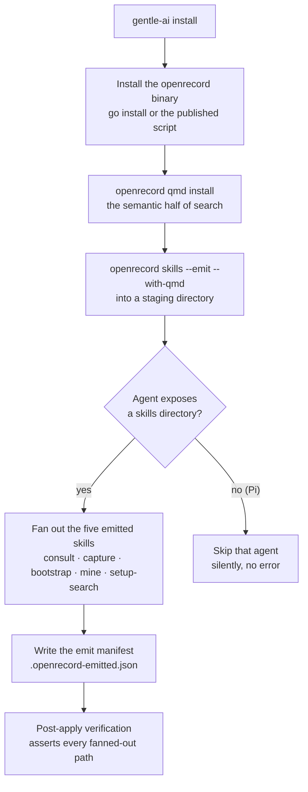
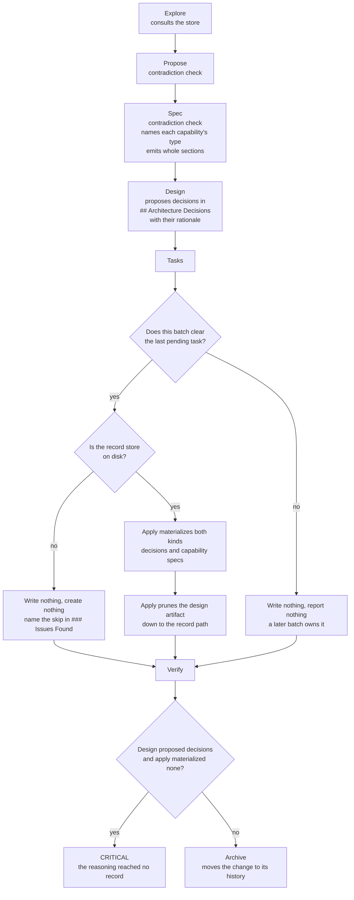
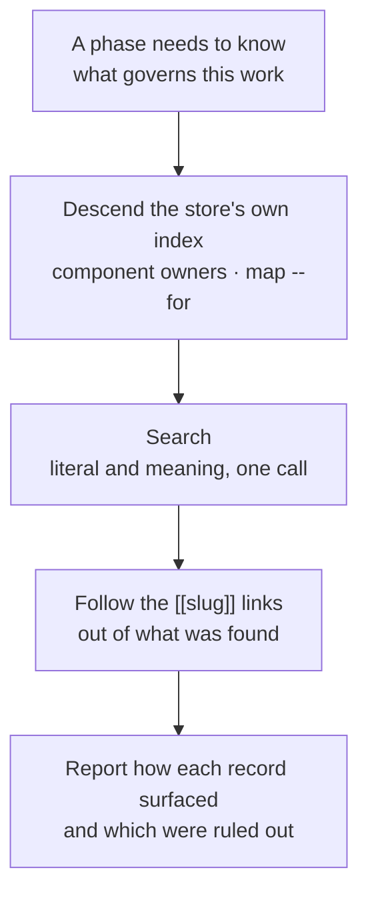

# openrecord inside Gentle AI

<- [Back to README](../README.md)

---

Gentle AI runs two stores, and the line between them is one question: **can this stop a future change?**

Yes, it governs — it is a **record**, and openrecord holds it. No, it only helps someone resume — it is **memory**, and Engram holds it. Engram is also the bus: every SDD phase runs headless with no memory, so writing to a topic key is the only way one phase reaches the next.

openrecord is a first-class component. It ships in every non-custom preset, the doctor fails without its binary, and nothing asks whether it is enabled — there is no config key, no status field and no injected value for a phase to consult before acting.

---

## What install puts in place

The skills ship with the binary and are re-emitted on upgrade. Gentle AI never writes its own copy of them: a private copy drifts from the tool silently, and the first symptom is a store that fails `validate` for reasons nobody can trace.

`--with-qmd` is not decoration. Without it no emitted skill mentions semantic search at all, so install provisions qmd first and the flag always matches reality.

---

## How a change moves through the two stores

**Apply is the sole writer.** No other phase touches the store — not design, which proposes without writing, and not archive, which never touches it at all.

**The prune is what makes the write a move rather than a copy.** Design writes each decision's rationale in full, because that artifact is the only channel apply has to read it. Once the record holds it, a second durable copy is exactly the duplication this boundary exists to remove, so apply rewrites the artifact down to the record's path and nothing else — no status word, since the record carries the status.

**No write, no prune.** When the store is absent apply materializes nothing, and pruning then would destroy the only copy of the reasoning that exists.

---

## Consulting: three moves, not one

Wiring semantic search and calling retrieval solved is the common integration mistake. Index descent is the only move that enumerates, and the only one that works before you know what you are looking for. The meaning pass earns its place because a question asked in the words of the task rarely matches the words of a record written months earlier. And a large share of relevant records arrive by following a link out of the first one found — a consult that stops at the first hit systematically misses the records that depend on it.

Reporting how each record surfaced is not bookkeeping: it lets a reader tell a thorough consult from one lucky query, and a section naming what was examined and ruled out separates *considered and judged irrelevant* from *never looked at*.

---

## Two rules that are easy to get wrong

**A record that is `pending` settles nothing.** It constrains nothing and authorises nothing either. Reading one as licence to choose invents a mandate nobody granted, and the reading is tempting because an open question looks like an invitation. Work that depends on it says so instead.

**A record file is never touched with a file-editing tool.** Every guard openrecord performs lives on its own write path, so an edit that goes around that path goes around all of them. This binds apply hardest, as the sole writer. openrecord does not police anyone's editor — `validate` reports `body-hash-mismatch` afterwards, which is detection, not prevention.

---

## When work contradicts an accepted record

The line of work that depends on the conflict stops. Not everything else — only what cannot proceed without resolving it. Both sides are surfaced with their reasons, and the conflict is never resolved alone: a record was accepted by a person, and an agent that overrides one silently makes the store a lie while everyone downstream keeps trusting it.

The record turning out to be wrong or stale is a perfectly good outcome. It is just not the agent's to conclude alone.

---

## Full Documentation

For the tool itself, its commands and its store format: [github.com/franwerner/open-record](https://github.com/franwerner/open-record)
